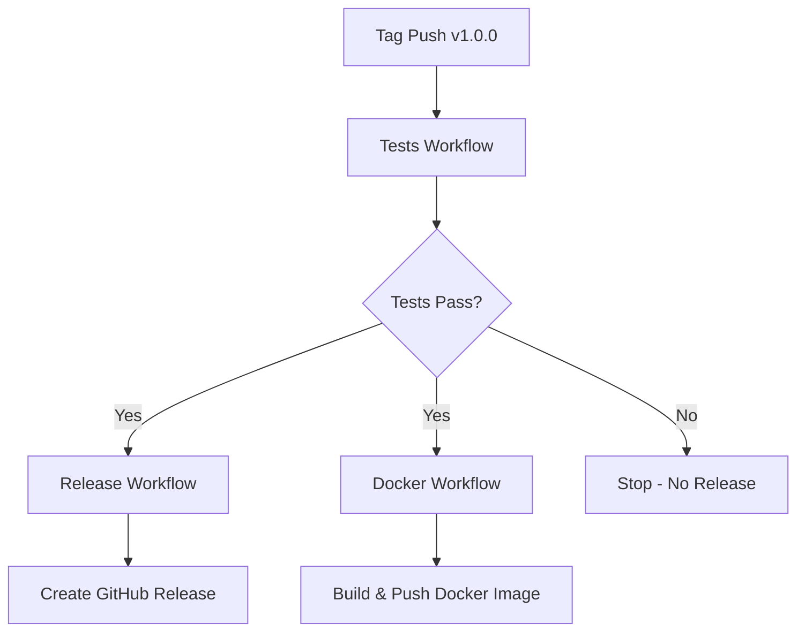
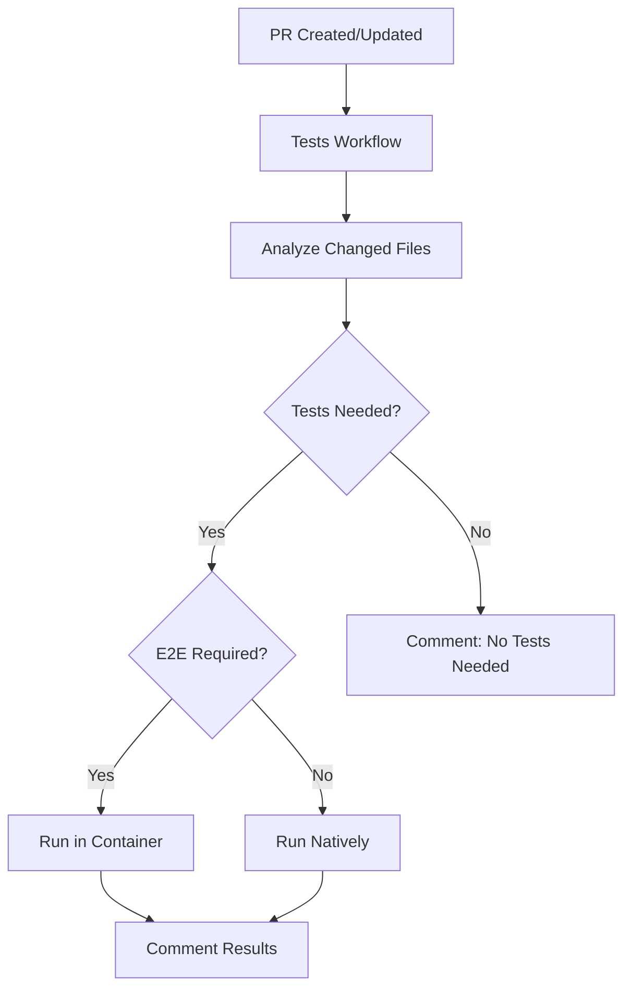
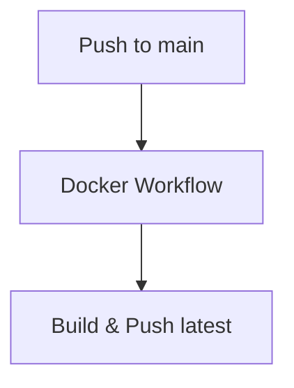

# CI/CD Pipeline

## Overview

The project uses GitHub Actions for continuous integration and deployment. The pipeline ensures all tests pass before creating releases or publishing Docker images.

## Workflows

### Tests Workflow ([.github/workflows/pr-tests.yml](.github/workflows/pr-tests.yml))

**Triggers:**
- Pull requests to `main` or `devel` branches
- Tag pushes matching `v*` pattern
- Called by other workflows via `workflow_call`

**Behavior:**

| Event Type | Test Strategy | Environment |
|------------|---------------|-------------|
| PR to main/devel | Smart testing (changed files only) | Native or container (based on test type) |
| Tag push (v*) | ALL tests including E2E | Container |
| Other pushes | No tests run | N/A |

**Test Execution:**
1. Analyzes changed files to determine which tests to run
2. For unit/API tests: Runs natively (faster)
3. For E2E tests: Builds Docker container and runs tests inside
4. For tag pushes: Always runs all tests in container
5. Comments on PRs with test results (success/failure)

**Outputs:**
- `needs_tests`: Whether any tests need to run
- `needs_e2e`: Whether E2E tests are required

### Release Workflow ([.github/workflows/release.yml](.github/workflows/release.yml))

**Trigger:**
- Tag pushes matching `v*` pattern

**Dependencies:**
- Calls Tests workflow first
- Only proceeds if tests pass

**Steps:**
1. Run all tests via Tests workflow
2. Generate changelog from conventional commits
3. Create GitHub release with changelog
4. Include Docker image pull instructions

**Changelog Format:**
- Groups commits by type: Features, Bug Fixes, Documentation, Refactoring, Tests, Other
- Excludes `chore:` commits
- Includes Docker Hub image information

### Docker Image Workflow ([.github/workflows/docker-image.yml](.github/workflows/docker-image.yml))

**Triggers:**
- Pushes to `main` branch
- Tag pushes matching `v*.*.*` pattern

**Dependencies:**
- For tag pushes: Calls Tests workflow first
- For branch pushes: No test dependency

**Build Strategy:**

| Event Type | Tests Required | Tags Applied |
|------------|----------------|--------------|
| Tag push (v1.2.3) | Yes (all tests) | `1.2.3`, `latest` |
| Push to main | No | `latest` |

**Steps:**
1. For tags: Run all tests first
2. Extract version from tag or use `latest`
3. Build Docker image
4. Push to Docker Hub (cboulanger/pdf-tei-editor)

## Execution Flow

### For Tag Pushes (e.g., `git push origin v1.0.0`)



1. Tests workflow runs all tests including E2E
2. Release workflow waits → creates GitHub release on success
3. Docker workflow waits → builds and pushes image with version tag + latest

### For Pull Requests



1. Tests workflow analyzes changed files
2. Runs only relevant tests (smart testing)
3. Comments on PR with results

### For Branch Pushes (e.g., to main)



1. Docker workflow builds and pushes `latest` tag
2. No tests run (tests already validated in PR)

## Test Filtering

The test workflow uses smart filtering to minimize test execution time:

- **Changed file analysis**: Uses `git diff` to identify modified files
- **Test mapping**: [tests/smart-test-runner.js](../../tests/smart-test-runner.js) maps files to tests
- **Always-run tests**: Some tests (marked with `alwaysRun: true`) run on every PR
- **E2E detection**: Automatically switches to container mode if E2E tests are needed

## Key Configuration

### Concurrency
- PRs: `tests-${{ github.event.pull_request.number }}`
- Tags: `tests-${{ github.ref }}`
- Prevents duplicate runs, cancels in-progress runs for PRs

### Timeouts
- Test workflow: 30 minutes maximum

### Caching
- Docker layer caching enabled (GitHub Actions cache)
- npm dependencies cached between runs

### Secrets Required
- `DOCKERHUB_USERNAME`: Docker Hub username
- `DOCKERHUB_TOKEN`: Docker Hub access token
- `GITHUB_TOKEN`: Automatically provided by GitHub Actions

## Modifying the CI Pipeline

### Before Making Changes

1. **Read this document** to understand current pipeline structure
2. **Test locally** using the npm scripts that mirror CI behavior:
   - `npm run test:changed` - Mirrors PR test logic
   - `npm run test:container` - Mirrors tag/E2E test logic
3. **Consider impact** on release and deployment workflows

### Common Modifications

**Adding a new test type:**
1. Update [tests/smart-test-runner.js](../../tests/smart-test-runner.js) with file patterns
2. Add to appropriate test command in package.json
3. Test workflow will automatically pick it up

**Changing test strategy:**
1. Modify the "Check if tests are needed" step in pr-tests.yml
2. Update this documentation with new logic
3. Test with various file change scenarios

**Updating Docker build:**
1. Modify docker-image.yml build step
2. Consider whether tests should run before/after
3. Update Dockerfile if needed

**Modifying release process:**
1. Update release.yml steps
2. Ensure changelog generation logic matches commit conventions
3. Test with a pre-release tag first

### Testing Workflow Changes

**Local validation:**
```bash
# Validate workflow syntax
npm install -g @action/workflow-parser
workflow-parser .github/workflows/*.yml

# Test smart test runner
npm run test:changed -- app/src/app.js
npm run test:changed -- tests/e2e/upload.spec.js
```

**Safe deployment:**
1. Create a feature branch
2. Open PR to see test workflow in action
3. Create a pre-release tag (e.g., `v1.0.0-beta.1`) to test release workflow
4. Verify in GitHub Actions UI before merging

## Troubleshooting

### Tests not running on tag push
- Check tag format matches `v*` pattern
- Verify workflow_call is present in pr-tests.yml
- Check GitHub Actions logs for trigger events

### Docker build failing
- Check Docker Hub credentials in repository secrets
- Verify Dockerfile builds locally: `docker build -t test .`
- Check disk space (workflow clears space automatically)

### Release not created
- Ensure tests passed successfully
- Verify tag exists: `git tag -l`
- Check if GitHub token has sufficient permissions
- Review release.yml "needs: test" dependency

### Smart test runner issues
- Test locally: `npm run test:changed -- --names-only <files>`
- Check file patterns in tests/smart-test-runner.js
- Verify changed files are correctly detected in workflow logs
