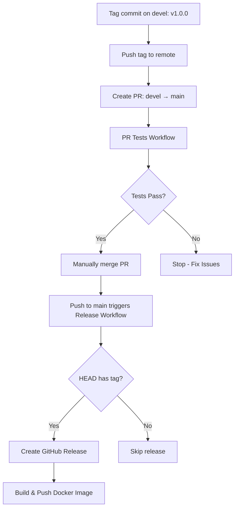
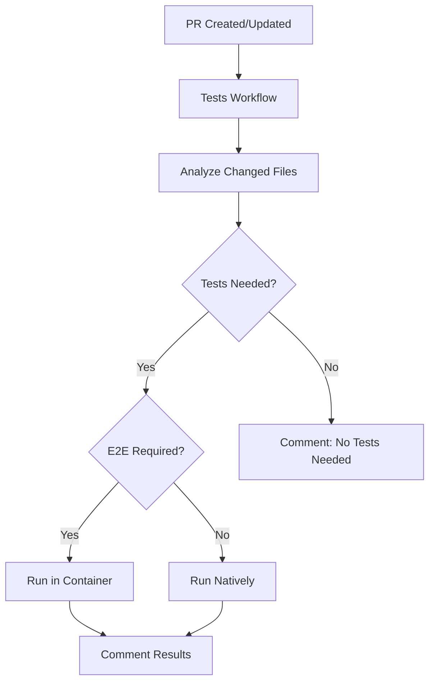

# CI/CD Pipeline

## Overview

The project uses GitHub Actions for continuous integration and deployment. The pipeline ensures all tests pass before creating releases or publishing Docker images.

## Workflows

### Tests Workflow ([.github/workflows/pr-tests.yml](.github/workflows/pr-tests.yml))

**Triggers:**

- Pull requests to `main` or `devel` branches
- Tag pushes matching `v*` pattern
- Called by other workflows via `workflow_call`

**Behavior:**

| Event Type | Test Strategy | Environment |
|------------|---------------|-------------|
| PR to main/devel | Smart testing (changed files only) | Native or container (based on test type) |
| Tag push (v*) | ALL tests including E2E | Container |
| Other pushes | No tests run | N/A |

**Test Execution:**

1. Analyzes changed files to determine which tests to run
2. For unit/API tests: Runs natively (faster)
3. For E2E tests: Builds Docker container and runs tests inside
4. For tag pushes: Always runs all tests in container
5. Comments on PRs with test results (success/failure)

**Outputs:**

- `needs_tests`: Whether any tests need to run
- `needs_e2e`: Whether E2E tests are required

### Release Workflow ([.github/workflows/release.yml](.github/workflows/release.yml))

**Trigger:**

- Push to `main` branch (typically via merged PR)

**Behavior:**

- Only runs if HEAD commit has a version tag (e.g., `v1.0.0`)
- Skips if no tag is present (normal commits to main)

**Steps:**

1. Check if HEAD has a version tag
2. Generate changelog from conventional commits (between tags)
3. Create GitHub release with changelog
4. Trigger Docker build workflow

**Changelog Format:**

- Groups commits by type: Features, Bug Fixes, Documentation, Refactoring, Tests, Other
- Excludes `chore:` commits
- Includes Docker Hub image information

**Note:** Tests are run via PR workflow before merge, not in the release workflow

### Docker Image Workflow ([.github/workflows/docker-image.yml](.github/workflows/docker-image.yml))

**Trigger:**

- Called by Release workflow via `workflow_call`

**Behavior:**

- Only runs if Release workflow detects a version tag
- Runs after GitHub release is created

**Build Strategy:**

| Event Type              | Tests Required              | Tags Applied      |
|-------------------------|-----------------------------|-------------------|
| Push to main with tag   | Yes (via PR tests)          | `1.2.3`, `latest` |

**Steps:**

1. Extract version from tag at HEAD
2. Build Docker image with `production` target
3. Push to Docker Hub (cboulanger/pdf-tei-editor)

## Execution Flow

### For Releases (e.g., tag `v1.0.0` on devel, then merge to main)



**Process:**

1. Run `node bin/release.js patch` (or minor/major) on devel branch
2. Create PR to merge devel into main
3. PR tests workflow validates changes
4. Manually merge PR after tests pass
5. Push to main triggers release workflow
6. Release workflow detects tag at HEAD and creates GitHub release
7. Docker image is built and pushed with version tag + latest

### For Pull Requests



1. Tests workflow analyzes changed files
2. Runs only relevant tests (smart testing)
3. Comments on PR with results

### For Branch Pushes (e.g., to main)

Pushes to `main` trigger the release workflow, which:

1. Checks if HEAD has a version tag
2. If tagged: Creates release and builds Docker image
3. If not tagged: Workflow skips without action

The `main` branch should only be updated via:

1. Pull requests (validated by PR tests)
2. Hotfix merges (must pass PR tests first)

## Test Filtering

The test workflow uses smart filtering to minimize test execution time:

- **Changed file analysis**: Uses `git diff` to identify modified files
- **Test mapping**: [tests/smart-test-runner.js](../../tests/smart-test-runner.js) maps files to tests
- **Always-run tests**: Some tests (marked with `alwaysRun: true`) run on every PR
- **E2E detection**: Automatically switches to container mode if E2E tests are needed

## Key Configuration

### Concurrency

- PRs: `tests-${{ github.event.pull_request.number }}`
- Tags: `tests-${{ github.ref }}`
- Prevents duplicate runs, cancels in-progress runs for PRs

### Timeouts

- Test workflow: 30 minutes maximum

### Caching

- Docker layer caching enabled (GitHub Actions cache)
- npm dependencies cached between runs

### Secrets Required

- `DOCKERHUB_USERNAME`: Docker Hub username
- `DOCKERHUB_TOKEN`: Docker Hub access token
- `GITHUB_TOKEN`: Automatically provided by GitHub Actions (used for creating releases)

## Modifying the CI Pipeline

### Before Making Changes

1. **Read this document** to understand current pipeline structure
2. **Test locally** using the npm scripts that mirror CI behavior:
   - `npm run test:changed` - Mirrors PR test logic
   - `npm run test:container` - Mirrors tag/E2E test logic
3. **Consider impact** on release and deployment workflows

### Common Modifications

**Adding a new test type:**

1. Update [tests/smart-test-runner.js](../../tests/smart-test-runner.js) with file patterns
2. Add to appropriate test command in package.json
3. Test workflow will automatically pick it up

**Changing test strategy:**

1. Modify the "Check if tests are needed" step in pr-tests.yml
2. Update this documentation with new logic
3. Test with various file change scenarios

**Updating Docker build:**

1. Modify docker-image.yml build step
2. Consider whether tests should run before/after
3. Update Dockerfile if needed

**Modifying release process:**

1. Update release.yml steps
2. Ensure changelog generation logic matches commit conventions
3. Test with a pre-release tag first

### Testing Workflow Changes

**Local validation:**

```bash
# Validate workflow syntax
npm install -g @action/workflow-parser
workflow-parser .github/workflows/*.yml

# Test smart test runner
npm run test:changed -- app/src/app.js
npm run test:changed -- tests/e2e/upload.spec.js
```

**Safe deployment:**

1. Create a feature branch
2. Open PR to see test workflow in action
3. Create a pre-release tag (e.g., `v1.0.0-beta.1`) to test release workflow
4. Verify in GitHub Actions UI before merging

## Troubleshooting

### Release not created after merging PR

- Verify tag exists at HEAD on main: `git tag --points-at HEAD`
- Check that tag format matches `v*` pattern
- Review release workflow logs for tag detection
- Ensure push to main triggered the workflow

### Docker build failing

- Check Docker Hub credentials in repository secrets
- Verify Dockerfile builds locally: `docker build -t test .`
- Check disk space (workflow clears space automatically)
- Ensure release workflow completed successfully

### Tests not running on PR

- Verify PR targets `main` or `devel` branch
- Check GitHub Actions logs for trigger events
- Review smart-test-runner.js file patterns

### Smart test runner issues

- Test locally: `npm run test:changed -- --names-only <files>`
- Check file patterns in tests/smart-test-runner.js
- Verify changed files are correctly detected in workflow logs

### Tag not detected in release workflow

- Ensure tag was pushed: `git push --tags`
- Verify tag is on the commit that was merged to main
- Check that tag follows `v*` pattern (e.g., `v1.0.0`)
- Review "Get tag for current commit" step in workflow logs
