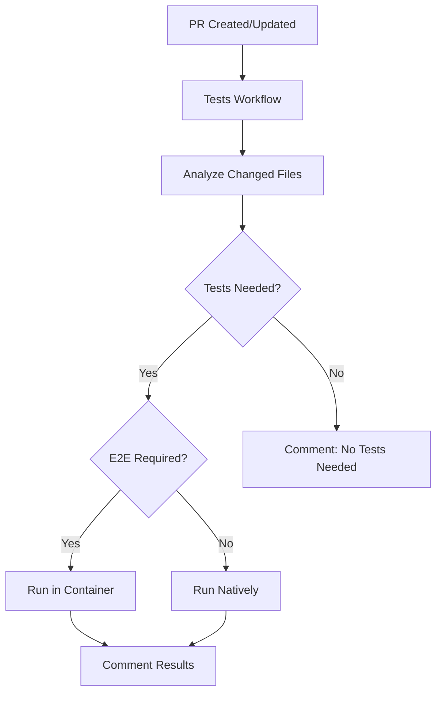

# CI/CD Pipeline

## Overview

The project uses GitHub Actions for continuous integration and deployment. The pipeline ensures all tests pass before creating releases or publishing Docker images.

## Workflows

### Tests Workflow ([.github/workflows/pr-tests.yml](../../.github/workflows/pr-tests.yml))

**Triggers:**

- Pull requests to `main` or `devel` branches
- Called by other workflows via `workflow_call`

**Behavior:**

| Event Type | Test Strategy | Environment |
|------------|---------------|-------------|
| PR to main/devel | Smart testing (changed files only) | Native or container (based on test type) |
| Other pushes | No tests run | N/A |

**Test Execution:**

1. Analyzes changed files to determine which tests to run
2. For unit/API tests: Runs natively (faster)
3. For E2E tests: Builds Docker container and runs tests inside
4. Comments on PRs with test results (success/failure)

**Outputs:**

- `needs_tests`: Whether any tests need to run
- `needs_e2e`: Whether E2E tests are required

### Release Workflow ([.github/workflows/release.yml](../../.github/workflows/release.yml))

**Trigger:**

- `push` to `main` (i.e. a merged `devel -> main` PR), or manual `workflow_dispatch`.

**Behavior:**

- Runs [`semantic-release`](https://github.com/semantic-release/semantic-release)
  with the config in [.releaserc.json](../../.releaserc.json).
- `semantic-release` inspects Conventional Commit messages since the last
  `v*` tag and decides the bump: `fix:` -> patch, `feat:` -> minor,
  `feat!:` / `BREAKING CHANGE:` -> major.
- If a release is warranted it:
  1. Updates `CHANGELOG.md` (`@semantic-release/changelog`).
  2. Bumps `package.json` version (`@semantic-release/npm`, `npmPublish: false`).
  3. Commits `chore(release): X.Y.Z [skip ci]` to `main` and pushes it
     (`@semantic-release/git`).
  4. Creates the `vX.Y.Z` git tag and the GitHub Release with generated notes
     (`@semantic-release/github`).
- If no commit since the last tag changes the version, nothing is published and
  the workflow ends cleanly.
- A release is detected by comparing `HEAD` before and after the
  `semantic-release` run; the job exposes outputs `published`, `version`, and
  `release_sha`.

**Downstream jobs (only when a release was published):**

1. `docker` - reusable call to `docker-image.yml`, building the release commit
   (`release_sha`) and pushing `X.Y.Z` + `latest`.
2. `release-notes-footer` - appends `docker pull` instructions and the Docker Hub
   link to the GitHub Release notes (runs only if `docker` succeeded; idempotent).
3. `back-merge` - opens an auto-merge PR `main -> devel` so `devel` picks up the
   `package.json` / `CHANGELOG.md` release commit. Depends only on the `release`
   job, so a Docker build failure never blocks branch reconciliation.

**Requirements:**

- `devel -> main` PRs MUST be merged as a **merge commit** (never squashed), so
  `semantic-release` sees every `feat:` / `fix:` individually.
- `github-actions[bot]` must be allowed to bypass branch protection on `main`
  (see [semantic-release-setup.md](semantic-release-setup.md)).
- `[skip ci]` in the release commit prevents `release.yml` re-triggering itself;
  pushes made with `GITHUB_TOKEN` also do not start new workflow runs.

**Note:** Tests are NOT re-run here - the required checks on the merged PR
validated the identical tree.

### Docker Image Workflow ([.github/workflows/docker-image.yml](../../.github/workflows/docker-image.yml))

**Trigger:**

- `workflow_call` only, from `release.yml`'s `docker` job.

**Inputs:**

| Input | Meaning |
| --- | --- |
| `version` | Image tag without leading `v` (e.g. `1.2.3`), from the `semantic-release` output. |
| `ref` | The release commit SHA to build (contains the bumped `package.json`). |

**Steps:**

1. Free disk space on the runner.
2. Checkout `inputs.ref`.
3. Build the `production` target and push `cboulanger/pdf-tei-editor:<version>`
   and `:latest` to Docker Hub.

## Execution Flow

### For Releases

```mermaid
graph TD
    A[Open PR: devel -> main] --> B[pr-tests.yml: full smart test suite]
    B --> C[release-preview job comments pending version]
    C --> D{Reviewer merges as a MERGE COMMIT}
    D --> E[push to main triggers release.yml]
    E --> F[semantic-release: analyse commits]
    F --> G{Version bump needed?}
    G -->|No| H[Stop - nothing published]
    G -->|Yes| I[Update CHANGELOG.md + package.json]
    I --> J[Commit chore(release) to main + tag vX.Y.Z]
    J --> K[Create GitHub Release]
    K --> L[docker job: build release commit, push X.Y.Z + latest]
    L --> M[release-notes-footer: append docker pull info]
    K --> N[back-merge: auto-merge PR main -> devel]
```

**Process:**

1. On `devel`, land work with Conventional Commit messages.
2. Open a `devel -> main` PR. `pr-tests.yml` runs the suite and comments the
   pending release version.
3. Merge the PR **as a merge commit** once checks pass.
4. `release.yml` runs `semantic-release`, which publishes the release and tag.
5. The Docker image is built and pushed; release notes get the `docker pull`
   footer.
6. Merge the automated `main -> devel` back-merge PR.

### For Pull Requests


```mermaid
graph TD
    A[PR Created/Updated] --> B[Tests Workflow]
    B --> C[Analyze Changed Files]
    C --> D{Tests Needed?}
    D -->|Yes| E{E2E Required?}
    D -->|No| F[Comment: No Tests Needed]
    E -->|Yes| G[Run in Container]
    E -->|No| H[Run Natively]
    G --> I[Comment Results]
    H --> I
```

1. Tests workflow analyzes changed files
2. Runs only relevant tests (smart testing)
3. Comments on PR with results

### For Branch Pushes (to `main`)

Every push to `main` triggers `release.yml`, which runs `semantic-release`.
If no commit since the last tag bumps the version, the run is a no-op.
`main` is only ever updated by:

1. Merged `devel -> main` PRs (validated by `pr-tests.yml`), merged as merge commits.
2. The `chore(release)` commit that `semantic-release` itself pushes.

## Test Filtering

The test workflow uses smart filtering to minimize test execution time:

- **Changed file analysis**: Uses `git diff` to identify modified files
- **Test mapping**: [tests/smart-test-runner.js](../../tests/smart-test-runner.js) maps files to tests
- **Always-run tests**: Some tests (marked with `alwaysRun: true`) run on every PR
- **E2E detection**: Automatically switches to container mode if E2E tests are needed

## Key Configuration

### Concurrency

- PRs: `tests-${{ github.event.pull_request.number }}`
- The `github.ref` fallback in the concurrency group now only applies to
  `workflow_call` invocations (no trigger keys on tags anymore)
- Prevents duplicate runs, cancels in-progress runs for PRs

### Timeouts

- Test workflow: 30 minutes maximum

### Caching

- Docker layer caching enabled (GitHub Actions cache)
- npm dependencies cached between runs

### Secrets Required

- `DOCKERHUB_USERNAME`: Docker Hub username
- `DOCKERHUB_TOKEN`: Docker Hub access token
- `GITHUB_TOKEN`: Automatically provided by GitHub Actions (used for creating releases)
- No `NPM_TOKEN` is needed - `@semantic-release/npm` runs with `npmPublish: false`.

## Modifying the CI Pipeline

### Before Making Changes

1. **Read this document** to understand current pipeline structure
2. **Test locally** using the npm scripts that mirror CI behavior:
   - `npm run test:changed` - Mirrors PR test logic
   - `npm run test:container` - Mirrors tag/E2E test logic
3. **Consider impact** on release and deployment workflows

### Common Modifications

**Adding a new test type:**

1. Update [tests/smart-test-runner.js](../../tests/smart-test-runner.js) with file patterns
2. Add to appropriate test command in package.json
3. Test workflow will automatically pick it up

**Changing test strategy:**

1. Modify the "Check if tests are needed" step in pr-tests.yml
2. Update this documentation with new logic
3. Test with various file change scenarios

**Updating Docker build:**

1. Modify docker-image.yml build step
2. Consider whether tests should run before/after
3. Update Dockerfile if needed

**Modifying the release process:**

1. Edit [.releaserc.json](../../.releaserc.json) - the plugin chain and rules.
2. Preview effects with `GH_TOKEN=$(gh auth token) npx semantic-release --dry-run --no-ci --branches "$(git branch --show-current)"`.
3. Update this document.

### Testing Workflow Changes

**Local validation:**

```bash
# Validate workflow syntax
npm install -g @action/workflow-parser
workflow-parser .github/workflows/*.yml

# Test smart test runner
npm run test:changed -- app/src/app.js
npm run test:changed -- tests/e2e/upload.spec.js
```

**Safe deployment:**

1. Create a feature branch
2. Open PR to see test workflow in action
3. For release-flow changes, run `GH_TOKEN=$(gh auth token) npx semantic-release --dry-run --no-ci --branches "$(git branch --show-current)"` locally
4. Verify in GitHub Actions UI before merging

## Troubleshooting

### No release created after merging a devel -> main PR

- Check the commit types since the last `v*` tag: only `feat:`, `fix:`, and
  `BREAKING CHANGE:` bump the version. A PR of only `chore:` / `docs:` / `test:` /
  `ci:` / `refactor:` commits publishes nothing - this is expected.
- Confirm the PR was merged as a **merge commit**, not squashed. A squash collapses
  all commit messages into one subject and hides the `feat:` / `fix:` types.
- Read the `release` job log: `semantic-release` prints the analysis and its
  decision.

### semantic-release push to main rejected

- `github-actions[bot]` needs a branch-protection / ruleset bypass on `main`.
  See [semantic-release-setup.md](semantic-release-setup.md).

### Back-merge PR has conflicts

- The `back-merge` job leaves the PR open. Resolve `main -> devel` conflicts
  manually and merge it (as a merge commit).

### Docker build failing

- Check Docker Hub credentials in repository secrets
- Verify Dockerfile builds locally: `docker build -t test .`
- Check disk space (workflow clears space automatically)
- Ensure release workflow completed successfully

### Tests not running on PR

- Verify PR targets `main` or `devel` branch
- Check GitHub Actions logs for trigger events
- Review smart-test-runner.js file patterns

### Smart test runner issues

- Test locally: `npm run test:changed -- --names-only <files>`
- Check file patterns in tests/smart-test-runner.js
- Verify changed files are correctly detected in workflow logs
