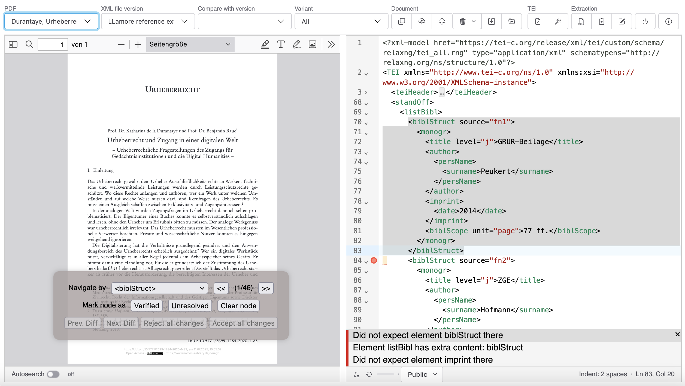

# Interface Overview

The PDF-TEI Editor features a three-panel layout designed for efficient comparison and editing of PDF documents and their corresponding TEI markup.

## Main Layout

### Left Panel: PDF Viewer
The left panel contains the PDF.js-based document viewer:

- **Document Navigation**: Page controls, zoom, and search functionality
- **PDF Toolbar**: Standard PDF viewing tools including zoom, page navigation, and text selection
- **Page Display**: Shows the source PDF document with footnotes and bibliographic references

### Right Panel: XML Editor  
The right panel contains the CodeMirror-based XML editor:

- **Syntax Highlighting**: Color-coded TEI/XML markup for easy reading
- **Line Numbers**: Numbered lines for precise navigation
- **Schema Validation**: Real-time validation against TEI schemas with error highlighting
- **Status Bar**: Shows cursor position, indentation settings, and document status

### Center Panel: Floating Navigation
The center panel provides navigation and verification tools:

- **Navigate by**: XPath selector dropdown (defaults to `<biblStruct>`)
- **Navigation Controls**: Previous/Next buttons to jump between matching nodes
- **Node Verification**: Mark nodes as "Verified", "Unresolved", or "Clear node"
- **Diff Navigation**: When comparing versions, navigate between changes with "Prev. Diff"/"Next Diff"
- **Merge Controls**: Accept or reject changes when merging document versions

## Top Toolbar

The toolbar is organized into logical sections:

### File Management
- **PDF**: Dropdown list of available PDF documents
- **XML file version**: Version selector showing current document version
- **Compare with version**: Select version for side-by-side comparison
- **Variant**: Document variant selection (if applicable)

### Document Actions
- <!-- <sl-icon name="copy"></sl-icon> --> **Copy**: Create new version of current document
- <!-- <sl-icon name="cloud-upload"></sl-icon> --> **Upload**: Upload new XML file
- <!-- <sl-icon name="cloud-download"></sl-icon> --> **Download**: Download current XML file  
- <!-- <sl-icon name="trash3"></sl-icon> --> **Delete**: Delete options (current version, all versions, or all files)
- <!-- <sl-icon name="save"></sl-icon> --> **Save**: Save current revision with change documentation
- <!-- <sl-icon name="folder-symlink"></sl-icon> --> **Move**: Move files to different collection

### TEI Processing
- <!-- <sl-icon name="check-circle"></sl-icon> --> **Validate**: Validate XML against TEI schema
- <!-- <sl-icon name="magic"></sl-icon> --> **TEI Wizard**: Guided TEI enhancement and cleanup tools

### Synchronization
- <!-- <sl-icon name="arrow-repeat"></sl-icon> --> **Sync**: Synchronize with external WebDAV repositories

### AI Extraction
- <!-- <sl-icon name="filetype-pdf"></sl-icon> --> **Extract New**: Upload new PDF and extract references
- <!-- <sl-icon name="clipboard2-plus"></sl-icon> --> **Extract Current**: Re-extract references from current PDF
- <!-- <sl-icon name="pencil-square"></sl-icon> --> **Edit Instructions**: Modify AI extraction prompts

## Status Indicators

### XML Editor Status Bar
- **Line/Column Position**: Shows current cursor position (e.g., "Ln 1, Col 1")
- **Indentation**: Current indentation setting (e.g., "Indent: 2 spaces")
- **Document Status**: Various status indicators including:
  - Validation status
  - Save status  
  - Permission level
  - Access control information

### PDF Viewer Status
- **Page Navigation**: Current page and total page count
- **Zoom Level**: Current zoom percentage
- **Search Results**: Highlighting of search terms

## Navigation Features

### XPath Navigation
The floating panel allows navigation using XPath expressions:
- **Default**: `//tei:biblStruct` to navigate between bibliographic entries
- **Custom XPath**: Select "Custom XPath" to enter your own expression
- **Navigation Buttons**: Use << and >> to move between matching nodes

### Document Synchronization
The PDF and XML panels are synchronized:
- **Node Selection**: Selecting a node in XML highlights corresponding PDF area (when possible)
- **Search Integration**: Search terms can be synchronized between panels
- **Validation Feedback**: XML errors show context-aware information

