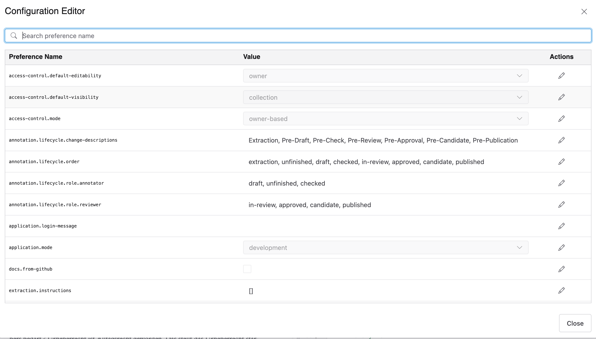

# Application configuration

The configuration editor is only accessible to administrator roles and can be opened via the left "Tools" dropdown menu, under the menu item "Configuration Editor".

## Overview

The configuration editor displays all application settings in a table with four columns:

| Column | Description |
| --- | --- |
| **Key** | The internal configuration key name (monospace font) |
| **Description** | A short explanation of what the setting controls |
| **Value** | The current value, shown read-only until edited |
| **Actions** | Buttons to edit, save, or reset the value |

## Searching

Use the search box at the top of the dialog to filter entries by key name or description. The list updates as you type.

## Editing a value

There are two ways to start editing a value:

- Click the **pencil icon** in the Actions column of the row you want to change.
- **Double-click** the value cell directly.

Once in edit mode, the value becomes interactive. Depending on the type of the setting, the editor may be:

- A **text input** for free-form strings or numbers
- A **dropdown** for settings with a fixed list of allowed values
- A **text area** for JSON objects or arrays

## Saving and resetting

While a value is being edited or has been changed, the row is highlighted and the action buttons change:

- **Check-circle icon** — saves the modified value to the server immediately.
- **Counterclockwise arrow icon** — discards your change and restores the original value.

Each value is saved individually. There is no global "save all" button.

A success or error notification appears after each save attempt.

## Notes

- Changes take effect immediately after saving
- If a setting expects a JSON value and you enter invalid JSON, an error notification is shown and the value is not saved.
- The configuration editor is not visible to non-administrator users.
