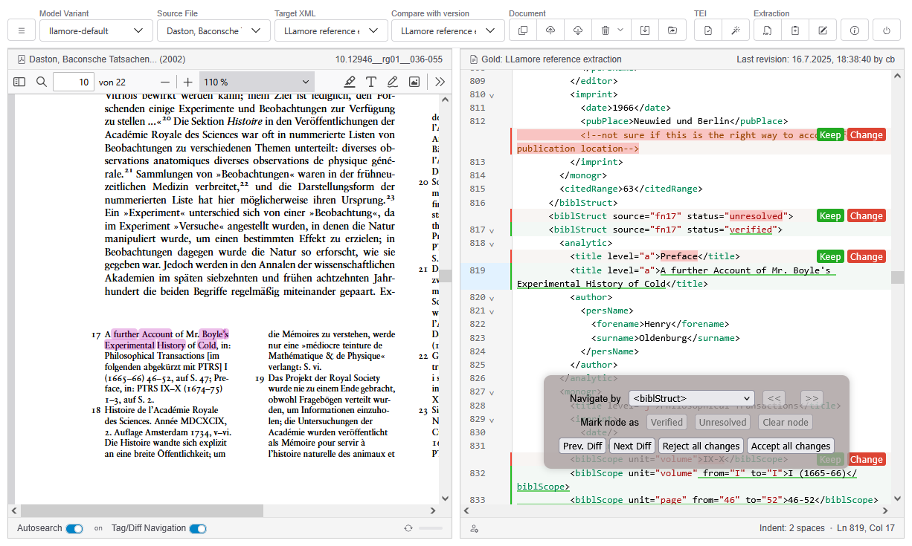
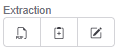
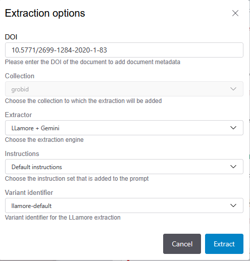
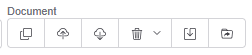
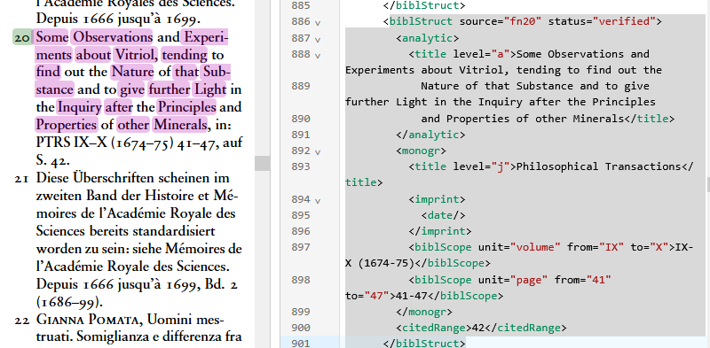
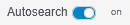
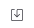
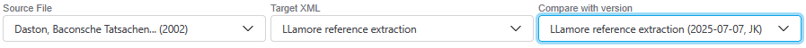
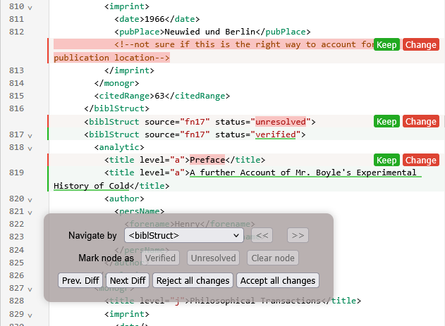

# PDF-TEI Editor Workflow for Training/Evaluation Datasets

For the creation of datasets that are to be used to train models or evaluate their performance, the basic workflow of the PDF-TEI Editor is this:

1. Extract data from PDF into first "gold" draft
2. Create a version and edit this version, saving one or more revisions
3. Merge revisions into the "gold" version
4. Retraining of models, revision of prompts

This workflow provides isolation of edits and an explicit audit trail that links edits with annotators. This trail is stored in the `<teiHeader>` element in the document.

### 1. Extract data from PDF

(Reviewer role)

By clicking on the first button in the "Extraction" button group, choose a PDF, which is uploaded. 

You are then asked to edit the extractor configuration

If the PDF has a DOI, enter it here to retrieve document metadata which will automatically be added to the TEI header element. 

Choose the extractor, which in most cases will be "Grobid" or "Llamore". This will then show additional configuration options:

- The "Grobid" extractor has different extraction models ("segmentation", "reference", etc.), which each constitute a variant. You can also select a custom "flavour", tied to a particular type of training data.
- the "LLamore" extractor lets you select "Instructions" which are added to th prompt and can be edited by clicking on the third button in the button group. 

Then, click on "Extract", this starts the extraction and produces a first version of the "gold" file, which refers to the "gold standard" dataset with the corrected and reviewed annotation data.

### 2. Versions, corrections and revisions

(Annotator role)

Unless the selected model has been trained with suffient high-quality data, the first extraction will contain many errors and omissions, which need to be corrected according to the annotation rules specific to the target model which the annotators have received.

Edits are always be done in copies, which merged by the reviewers into the "gold" version when they are ready.

- To create a copy of "gold", click on the first button in the "Document" button group (). In the dialog that appears, enter a "Version name" which clearly identifies the version (i.e. "Corrections by John") This creates a new version of the TEI document. You can provide additional comments in the "description" field if necessary, but that is optional.
- Work on this document as instructed by the annotation rules until you are ready to submit it to a reviewer. 

- By toggling "Autosearch" () in the footer of the PDF Viewer, you can search the contents of a `<biblStruct>` in the PDF automatically. This works only for the "Llamore" extraction, and isn't always reliable, so you might want to turn it on and off based on how it performs. 

- You can leave comments anywhere by enclosing them in the xml comment markup: `<!-- this is a comment -->`
- When you are done, click on the "Save document revision" button (). In the dialog's "Description" field, you can specify more exactly what you have been correcting, and add addtional comments if needed.

### 3. Merge revisions into the "gold" version

(Reviewer role)

Once annotators have finished their work:

- By selecting the gold version in the "Target XML" selectbox and the annotator's version in the "Compare with version" selectbox, reviewers can  compare the "gold" version with the changes in the annotator's version.

- The editor shows the differences visually and the reviewer can selectively accept ("Change") or reject ("Keep") changes. You can also use the "Tag/Div Navigation" panel which is shown when the switch in the PDF Viewer's status bar () is toggled, to navigate between locations with changes ("Prev. Diff", "Next Diff") or "Accept all changes" /"Reject all changes".
- Once a version has been merged into "gold", it can be deleted. However, it is recommended to keep the versions for later reference.

### 4. Retraining of model with gold dataset

When a batch of training data has been corrected, the "gold" standard can be downloaded and used to retrain the extraction models. 

