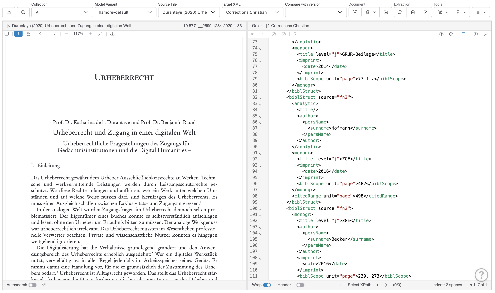

# Interface Overview

The PDF-TEI Editor features a two-panel layout designed for efficient comparison and editing of PDF documents and their corresponding TEI markup.

## Main Layout

### Left Panel: PDF Viewer

The left panel contains the PDF document viewer, which offers the following functionality shipped with the standard PDF.js viewer.

- **Header Bar**: Document title and document id 
- **Document Navigation**: Page controls, zoom, and search functionality
- **PDF Toolbar**: Standard PDF viewing tools including zoom, page navigation, and text selection
- **Page Display**: Shows the source PDF document with footnotes and bibliographic references

The header bar of the PDF viewer provides the following information:

- on the left, the PDF document title which is taken from document metadata. 
- on the right, the document id which is used to identify the PDF and all TEI annotations (regardless of variant) that belong to it.

Both values can be copied by single-click, in addition, administrators can change title and id by double-clicking.

In the status bar of the PDF viewer, you can toggle the "Autosearch" feature, which tries to automatically navigate to the position within the PDF that corresponds to the cursor position in the XML Editor. This lookup is computationally non-trivial and will often fail - use it as far as it works for you. 

### Right Panel: XML Editor  

The right panel contains the CodeMirror-based XML editor and provides the following features:

- **Syntax Highlighting**: Color-coded TEI/XML markup for easy reading
- **Schema Validation**: Real-time validation against TEI schemas with error highlighting

It consists of the following components:

- **Header Bar**: Displays version title (left) and docment information (locked status, saving indiccator, etc. ) on the right. The version title can be updated by double-clicking on it. 
- **Status Bar**: Shows cursor position, indentation settings, and document status

In the status bar of the XML editor, you can toggle the teiHeader element if there is one, set document permissions, and see information on indentation and cursor position.

## Top Toolbar

The toolbar is organized into logical sections:

### File Management

- **PDF**: Dropdown list of available PDF documents
- **XML file version**: Version selector showing current document version
- **Compare with version**: Select version for side-by-side comparison
- **Variant**: Document variant selection. Variants are generated by the available extraction engines.

### Document Actions

- <sl-icon name="copy"></sl-icon> **Copy**: Create new version of current document
- <sl-icon name="cloud-upload"></sl-icon> **Upload**: Upload new XML file
- <sl-icon name="cloud-download"></sl-icon> **Download**: Download current XML file  
- <sl-icon name="trash3"></sl-icon> **Delete**: Delete options (current version, all versions, or all files)
- <sl-icon name="save"></sl-icon> **Save**: Save current revision with change documentation
- <sl-icon name="folder-symlink"></sl-icon> **Move**: Move files to different collection

### TEI Processing

- <sl-icon name="check-circle"></sl-icon> **Validate**: Validate XML against TEI schema
- <sl-icon name="magic"></sl-icon> **TEI Wizard**: Guided TEI enhancement and cleanup tools

### Synchronization

- <sl-icon name="arrow-repeat"></sl-icon> **Sync**: Synchronize with external WebDAV repositories

### AI Extraction

- <sl-icon name="filetype-pdf"></sl-icon> **Extract New**: Upload new PDF and extract references
- <sl-icon name="clipboard2-plus"></sl-icon> **Extract Current**: Re-extract references from current PDF
- <sl-icon name="pencil-square"></sl-icon> **Edit Instructions**: Modify AI extraction prompts

## Navigation Features

### XPath Navigation

The floating panel allows navigation using XPath expressions:

- **Default**: `//tei:biblStruct` to navigate between bibliographic entries
- **Custom XPath**: Select "Custom XPath" to enter your own expression
- **Navigation Buttons**: Use << and >> to move between matching nodes
