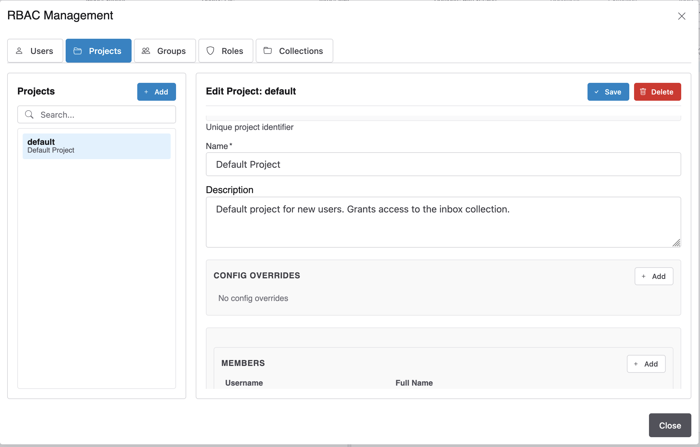

# RBAC Manager

The RBAC Manager is the administration UI for users, projects, collections, groups, and roles. It is only accessible to users with the **admin** role, via the **Manage Users & Roles** item in the left Tools dropdown menu.

See [User Management](./user-management.md) for background on the authentication and role system.



## Layout

The dialog is split into two panels:

- **Left panel** — list of all entities of the currently selected type, with a search input and an **Add** button to create a new entry.
- **Right panel** — the detail form for the selected entity, with **Save** and **Delete** buttons. Additional read-only or relationship sections appear below the form depending on the entity type.

Five tabs across the top switch between entity types: **Users**, **Projects**, **Groups**, **Roles**, and **Collections**.

---

## Access Control Model

Before making changes, it helps to understand how access is resolved:

```text
User → Project membership → Collections listed in the project → Documents in those collections
```

A user can see and open documents only in collections that belong to a project the user is listed in. Users with the `*` wildcard in their roles bypass project resolution and have access to all collections.

---

## Users Tab

| Field | Required | Notes |
| --- | --- | --- |
| Username | Yes | Unique login name; cannot be changed after creation |
| Password | Yes (on create) | Stored as a hash; leave blank when editing to keep the existing password |
| Email | No | Used for notifications if configured |
| Display name | No | Shown in revision history and the UI |
| Roles | No | Multiselect from defined roles; `*` grants unrestricted access |

When an existing user is selected, two read-only sections appear below the form:

- **Groups** — groups this user belongs to.
- **Projects** — projects this user is a member of, showing which collections they can access.

You cannot delete your own account. Passwords are hashed on save and cannot be recovered.

---

## Projects Tab

Projects are the primary access-control containers. Each project lists the users who are members and the collections they can access.

| Field | Required | Notes |
| --- | --- | --- |
| ID | Yes | URL-safe identifier (letters, numbers, `-`, `_`); cannot be changed after creation |
| Name | Yes | Human-readable display name |
| Description | No | Optional free-text note |

When an existing project is selected, three additional sections appear:

- **Members** — add or remove usernames. Each listed user can see all collections assigned to this project.
- **Collections** — add or remove collection IDs. Use `*` as the sole entry to grant members access to every collection (wildcard project).
- **Config Overrides** — key/value pairs that override the global application config for all documents in any of this project's collections. See [Config Overrides](#config-overrides) below.

---

## Collections Tab

Collections are named buckets of documents.

| Field | Required | Notes |
| --- | --- | --- |
| ID | Yes | URL-safe identifier; used as the storage directory name — choose carefully, it cannot be changed |
| Name | Yes | Display label shown in dropdowns throughout the UI |
| Description | No | Optional free-text note |

A newly created collection is not accessible to anyone until it is added to at least one project's Collections list. The `_inbox` collection is the system default for newly extracted documents and should always be included in at least one project.

---

## Groups Tab

Groups are named sets of users, usable for bulk permission assignments or external system references.

| Field | Required | Notes |
| --- | --- | --- |
| ID | Yes | URL-safe identifier |
| Name | Yes | Display name |

When an existing group is selected, a **Members** section appears for adding or removing usernames.

---

## Roles Tab

Roles carry permission strings that control what users can do. See [User Management](./user-management.md#user-roles) for the built-in role descriptions.

| Field | Required | Notes |
| --- | --- | --- |
| ID | Yes | Short role identifier (e.g. `annotator`) |
| Name | Yes | Display name |
| Permissions | No | Multiselect of permission strings; `*` grants full access |

The built-in roles (`admin`, `reviewer`, `annotator`) cannot be deleted. Roles are assigned to users on the Users tab.

---

## Config Overrides

Projects support per-entity configuration overrides layered on top of the global `config.json`.

To add an override:

1. Select the project or collection.
2. Scroll to the **Config Overrides** section and click **Add**.
3. Enter the config key (auto-suggested from the global config) and the desired value.
4. Click **Save** on the entity to persist.

To remove an override, click the delete icon next to the row, then save the entity.

Common use cases: enabling a specific extraction variant for one collection, restricting the annotation lifecycle statuses available in a project, or adjusting validation settings per collection.

---

## Typical Setup Workflow

1. **Create collections** — one per logical document batch or project scope.
2. **Create a project** — assign the relevant collections to it.
3. **Add members** — add the usernames of the users who should access those collections.
4. **Create users** if they don't exist yet — assign roles (e.g. `annotator` or `reviewer`).
5. **Verify access** — check the user's detail form to confirm the Projects section shows the expected project and collections.
